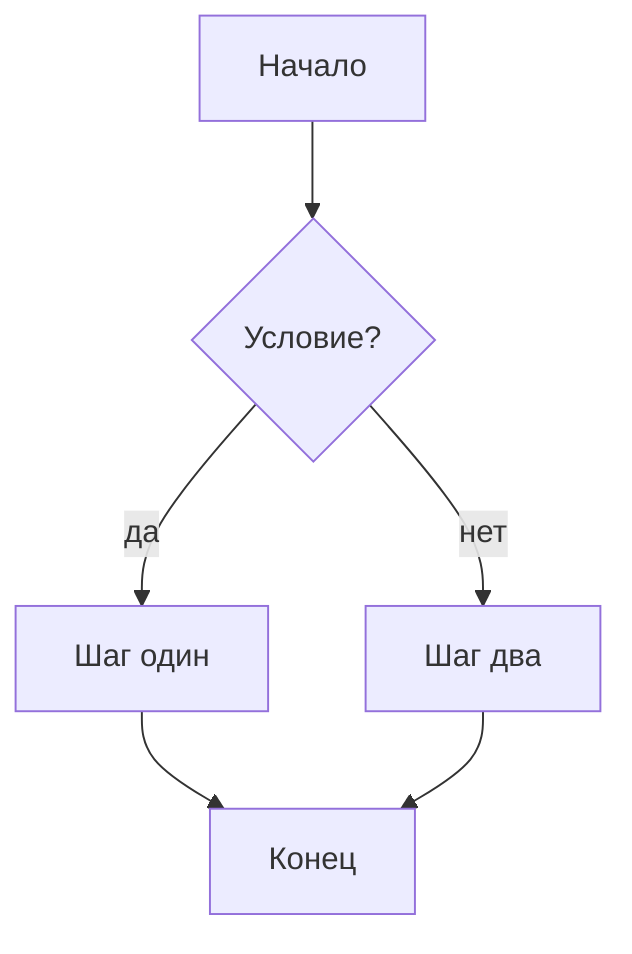
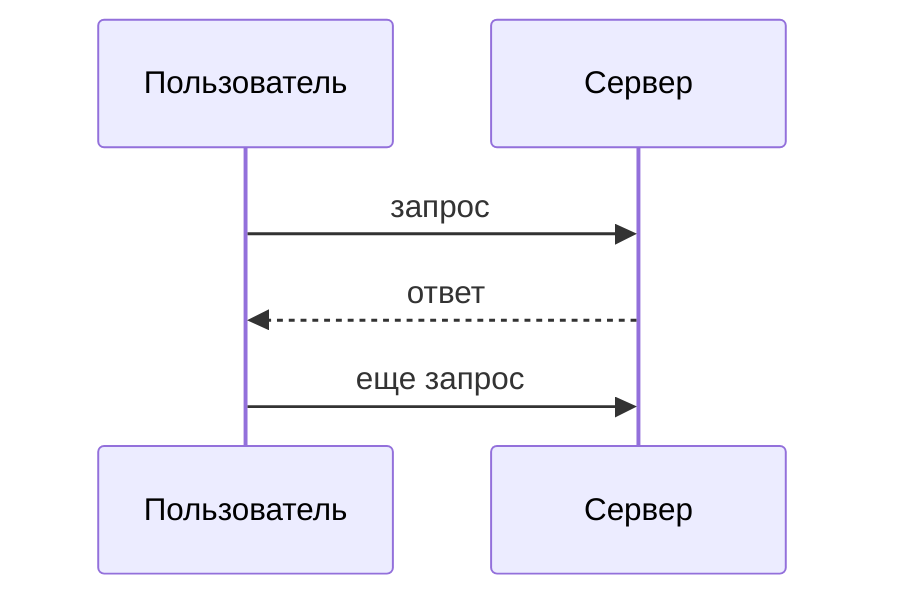
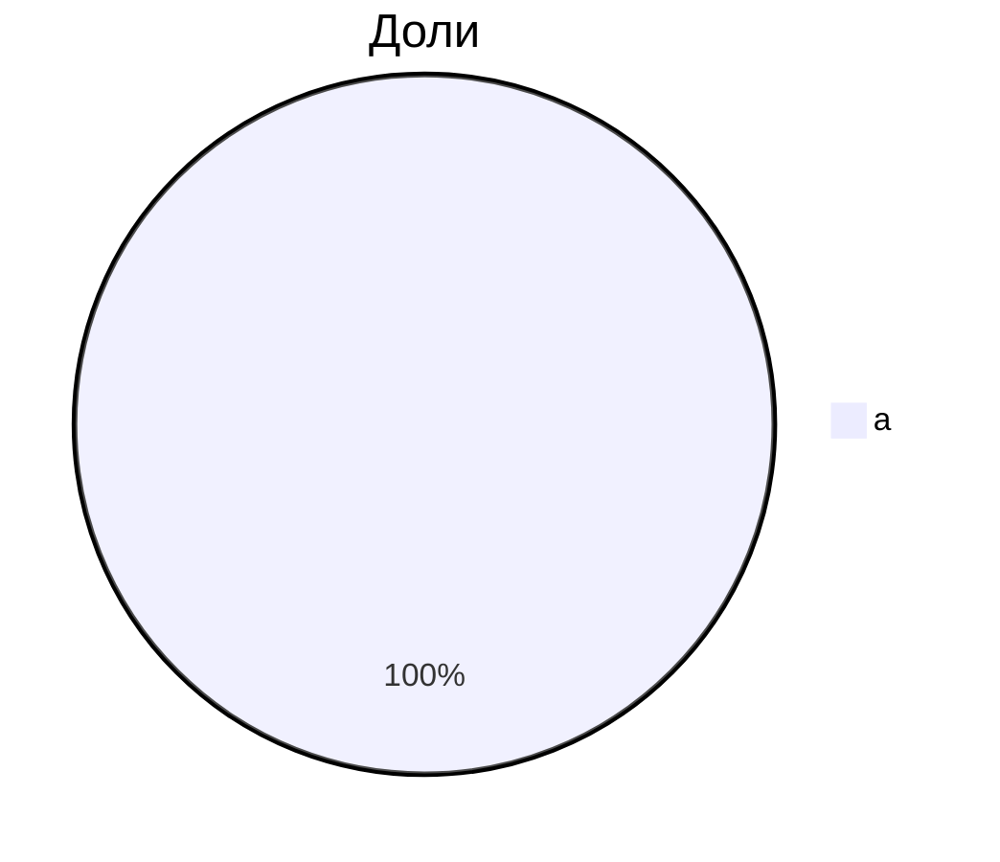

```mermaid
flowchart TD
    A[Начало] --> B{Условие?}
    B -->|да| C[Шаг один]
    B -->|нет| D[Шаг два]
    C --> E[Конец]
    D --> E
```

```mermaid
sequenceDiagram
    participant U as Пользователь
    participant S as Сервер
    U->>S: запрос
    S-->>U: ответ
    U->>S: еще запрос
```

```mermaid
pie title Доли
    "a" : 40
```
