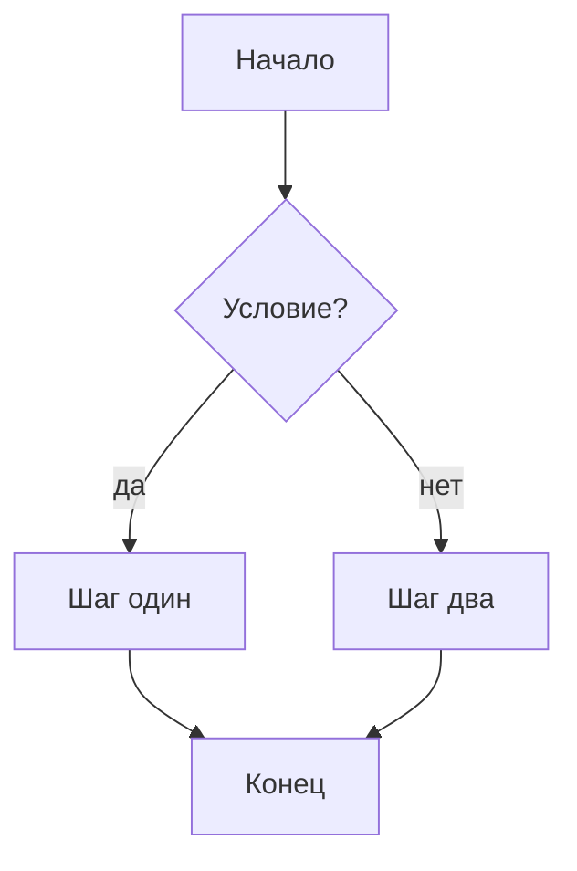
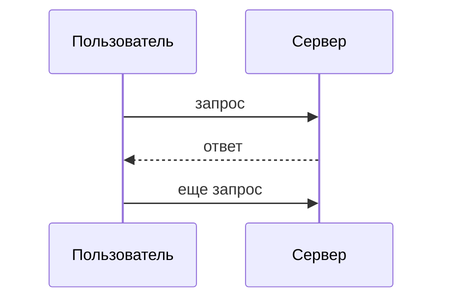
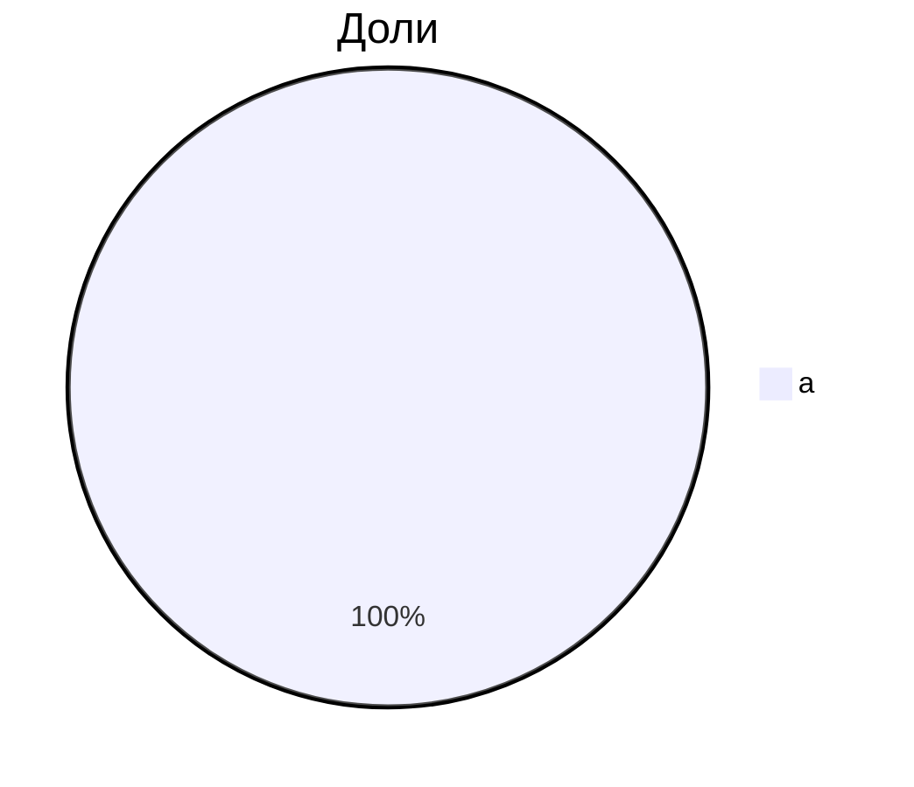
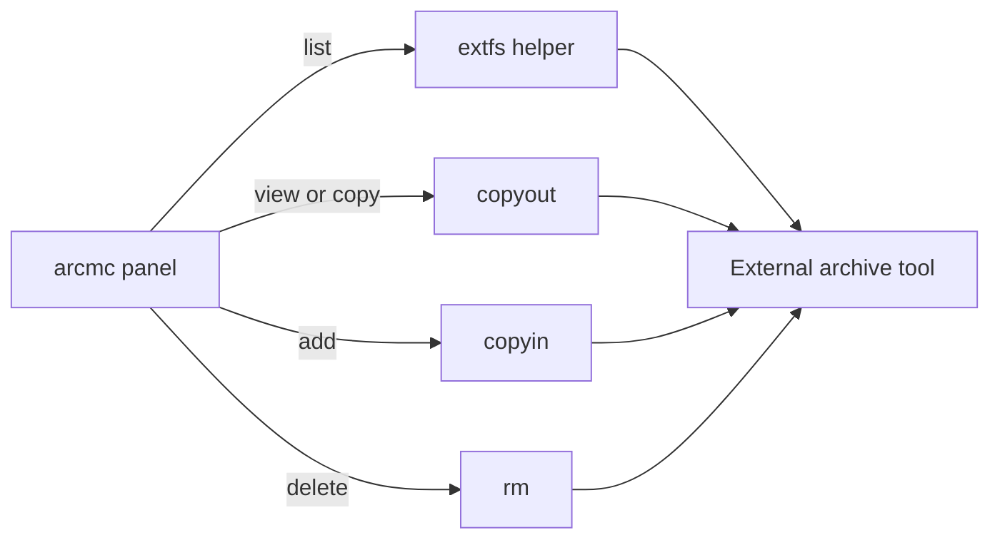
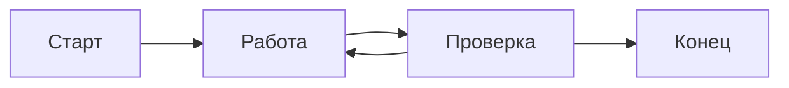

```mermaid
flowchart TD
    A[Начало] --> B{Условие?}
    B -->|да| C[Шаг один]
    B -->|нет| D[Шаг два]
    C --> E[Конец]
    D --> E
```

```mermaid
sequenceDiagram
    participant U as Пользователь
    participant S as Сервер
    U->>S: запрос
    S-->>U: ответ
    U->>S: еще запрос
```

```mermaid
pie title Доли
    "a" : 40
```

```mermaid
flowchart LR
    P[arcmc panel] -->|list| H[extfs helper]
    P -->|view or copy| C[copyout]
    P -->|add| I[copyin]
    P -->|delete| R[rm]
    H --> T[External archive tool]
    C --> T
    I --> T
    R --> T
```

```mermaid
flowchart LR
  A[Старт] --> B[Работа]
  B --> C[Проверка]
  C --> B
  C --> D[Конец]
```
