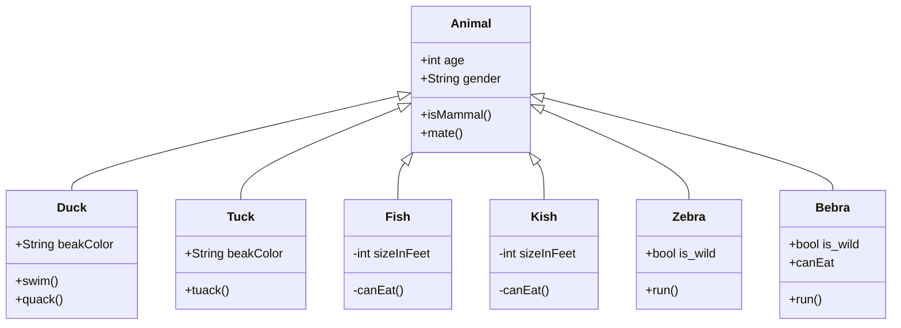

```mermaid
classDiagram
    Animal <|-- Duck
    Animal <|-- Tuck
    Animal <|-- Fish
    Animal <|-- Kish
    Animal <|-- Zebra
    Animal <|-- Bebra
    Animal : +int age
    Animal : +String gender
    Animal: +isMammal()
    Animal: +mate()
    class Duck{
      +String beakColor
      +swim()
      +quack()
    }
    class Tuck{
      +String beakColor
      +tuack()
    }
    class Fish{
      -int sizeInFeet
      -canEat()
    }
    class Kish{
      -int sizeInFeet
      -canEat()
    }
    class Zebra{
      +bool is_wild
      +run()
    }
      class Bebra{
      +bool is_wild
      +canEat
      +run()
    }
```
